# HƯỚNG DẪN CÀI ĐẶT

### Bước 1: truy cập vào trang web chứa source code

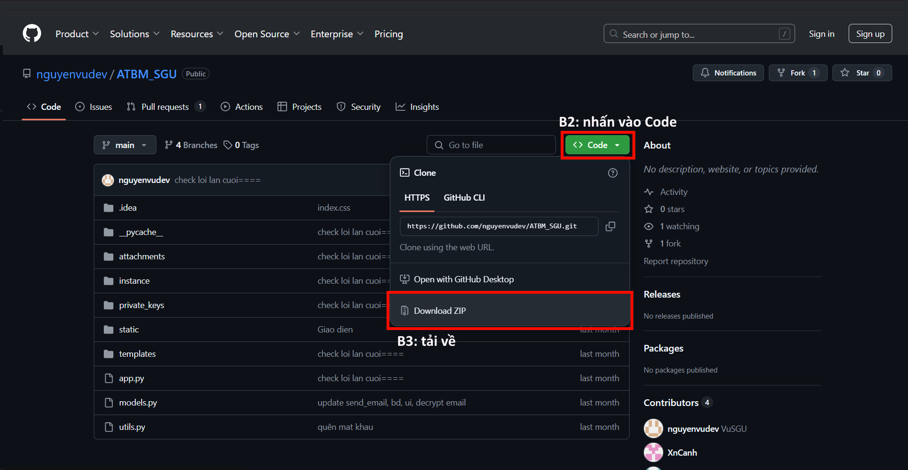

### Bước 2: nhấn vào nút “<> Code”

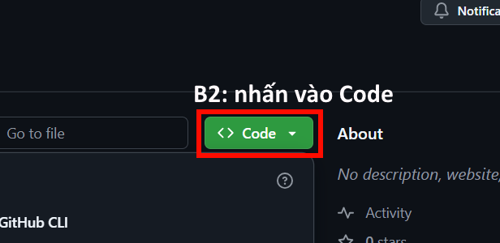

### Bước 3: nhấn “Download ZIP để tải source dưới dạng ZIP” để tải về

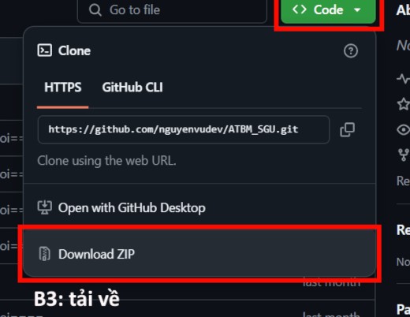

### Bước 4: truy cập vào thư mục chứa file zip

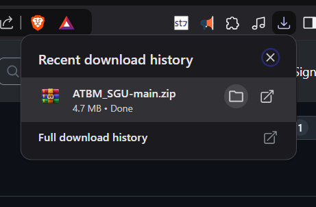

### Bước 5: giải nén file

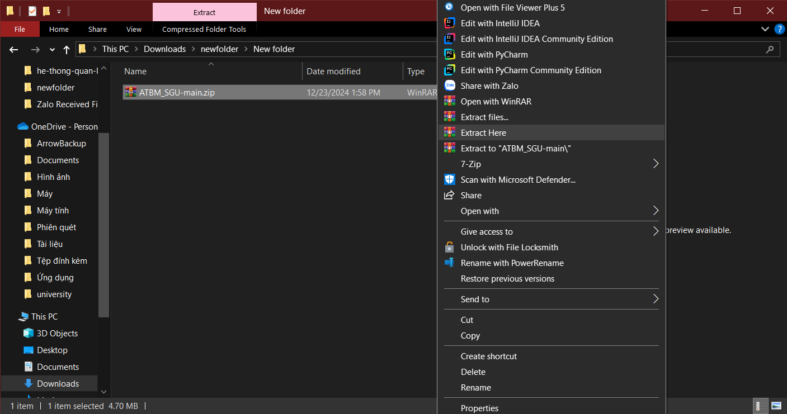

### Bước 6: mở thư mục source bằng IDE

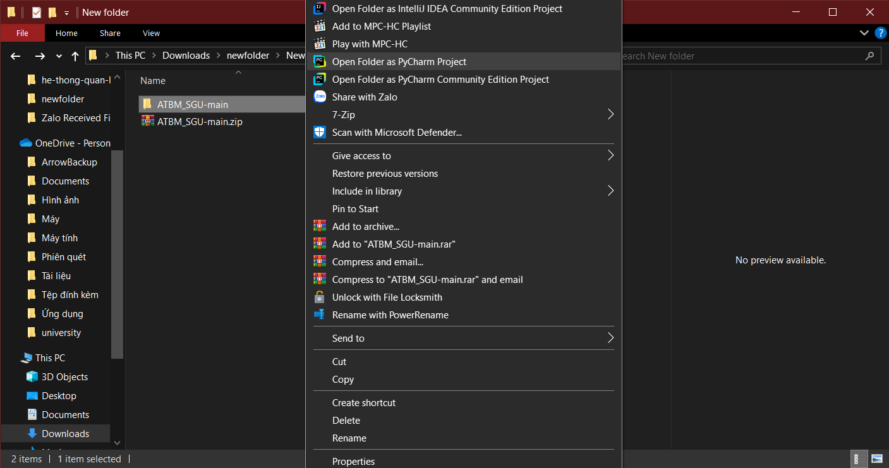

### Bước 7: truy cập vào terminal, tải những thư viện cần thiết để chạy code như: flask_mail, flask_socketio, flask_cors

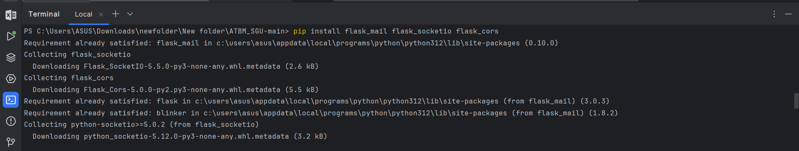

### Bước 8: sau đó truy cập vào file app.py 

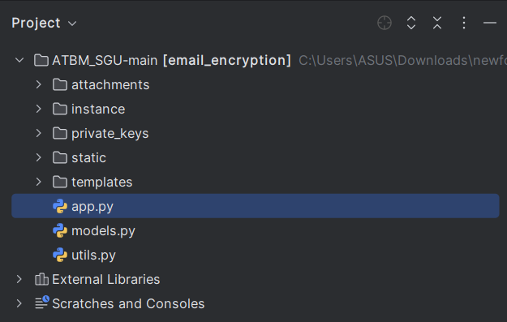

### Bước 9: chạy chương trình

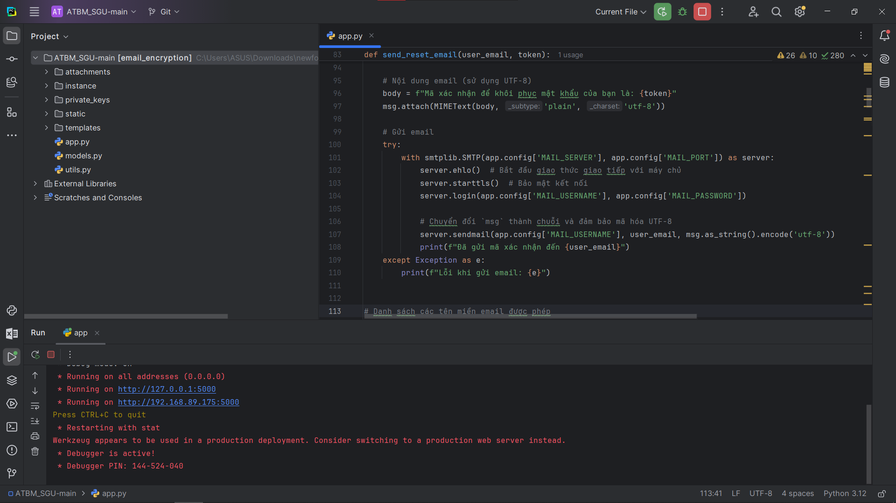

### Bước 10: truy cập vào domain và chúng ta đã được đưa đến trang chủ của website

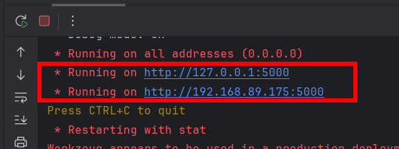

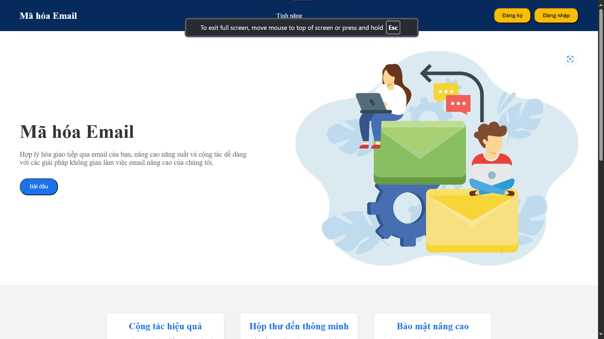
