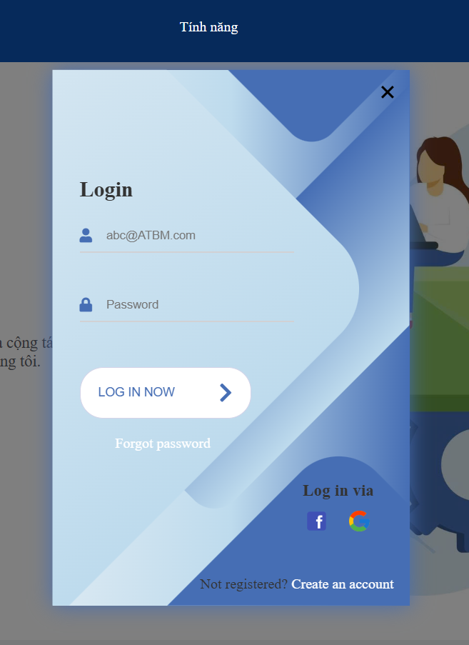
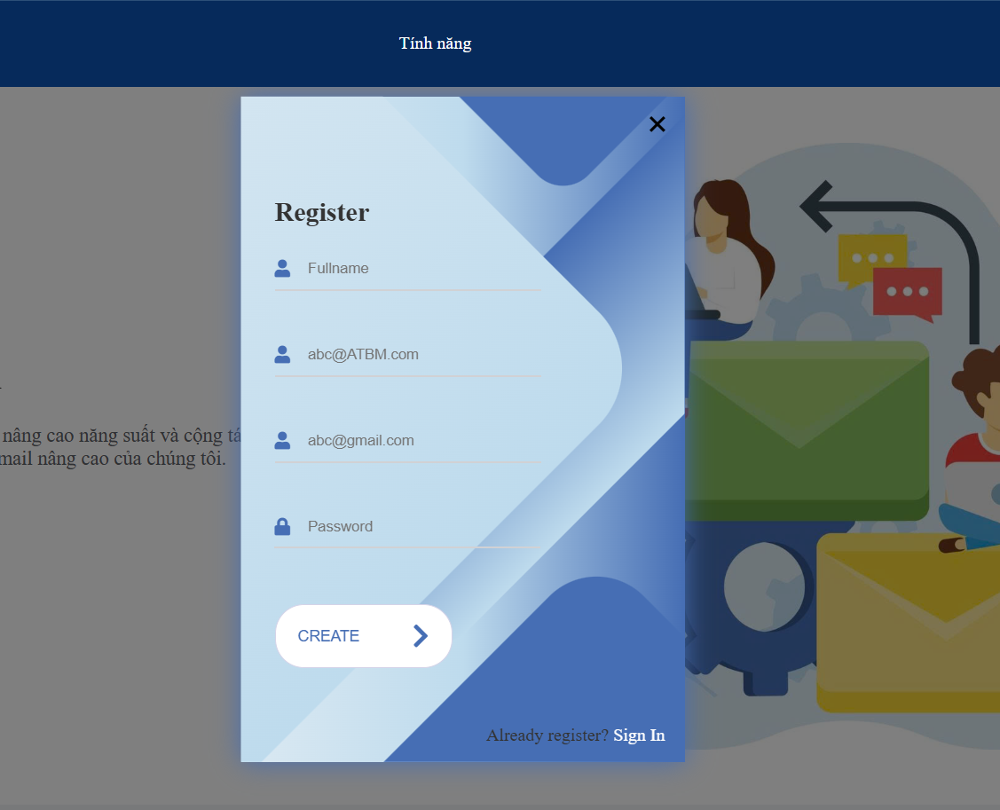
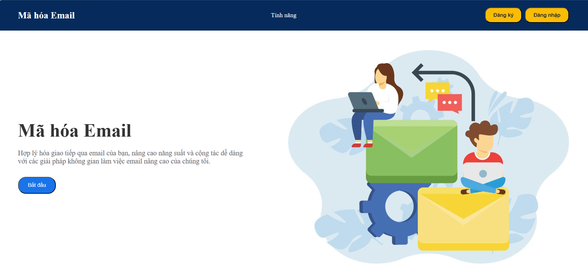
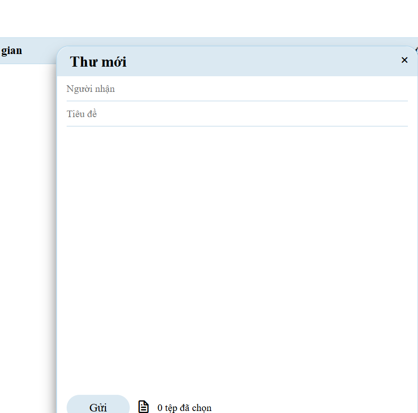

# 📧 Hệ Thống Email Bảo Mật (Secure Email System)

Dự án môn học **An toàn và Bảo mật thông tin (ATBM)** - Xây dựng hệ thống gửi/nhận email bảo mật sử dụng **Mã hóa lai (Hybrid Encryption)** và **Chữ ký số (Digital Signature)**.

---

## ✨ Các Tính Năng Nổi Bật của Dự Án

### 🔐 1. Hệ thống Mã hóa và Bảo mật Thông tin nâng cao
* **Mã hóa lai (Hybrid Encryption):** Kết hợp giữa **RSA (2048-bit)** để mã hóa khóa truyền tin và **AES-GCM (256-bit)** để mã hóa nội dung thư và tệp đính kèm. Điều này đảm bảo hiệu năng cao của AES và tính bảo mật trao đổi khóa của RSA.
* **Xác thực và Toàn vẹn dữ liệu (Chữ ký số):** Sử dụng chữ ký điện tử **RSA + SHA-256** để ký vào email, giúp người nhận xác thực nguồn gốc người gửi và đảm bảo nội dung thư không bị thay đổi trên đường truyền.
* **Bảo mật Khóa cá nhân (Private Key):** Khóa riêng tư của người dùng được mã hóa bằng mật khẩu của họ thông qua thuật toán **PBKDF2** kết hợp **AES-CBC** trước khi lưu vào Cơ sở dữ liệu. Người dùng cũng được tải file Private Key (.pem) về máy khi đăng ký thành công để tự quản lý.

### 💬 2. Các Tính Năng Hộp Thư Đầy Đủ
* **Đăng ký / Đăng nhập:** Hệ thống tự động cấp phát cặp khóa RSA (Public/Private Key) cho mỗi tài khoản mới. Kiểm soát tên miền hợp lệ (`@ATBM.com` hoặc `@ATBM.org`).
* **Hộp thư đến (Inbox) & Hộp thư đã gửi (Sent):** Tự động giải mã nội dung email và giải mã các file đính kèm trực tiếp trên giao diện khi người dùng truy cập.
* **Quản lý Thư rác (Trash):** Tính năng xóa tạm thời (đưa vào thùng rác), khôi phục thư và xóa vĩnh viễn thư đã chọn hoặc xóa toàn bộ thùng rác.
* **Tìm kiếm thông minh:** Tìm kiếm nhanh email theo tiêu đề hoặc địa chỉ người gửi.

### ⚡ 3. Trải nghiệm Real-time & Gửi OTP qua Email
* **Thông báo Thời gian thực (Real-time):** Tích hợp **WebSockets (Flask-SocketIO)** giúp cập nhật hộp thư lập tức ngay khi có email mới gửi tới mà không cần tải lại trang.
* **Khôi phục Mật khẩu an toàn:** Hỗ trợ tính năng quên mật khẩu, gửi mã xác nhận OTP thông qua SMTP của Google Mail (`Flask-Mail`) đến địa chỉ email dự phòng (Backup Email).

---

## 🎨 Giao Diện Ứng Dụng (User Interface)

### 1. Trang đăng nhập (Login)

### 2. Trang đăng ký (Register)

### 3. Hộp thư chính (Inbox & Dashboard)

### 4. Soạn thảo thư & Ký số (Compose & Digital Signature)

---

## 🛠️ Công Nghệ Sử Dụng (Technology Stack)

* **Backend:** Python, Flask Framework
* **Realtime Communication:** Flask-SocketIO (WebSockets)
* **Database:** SQLite & Flask-SQLAlchemy (ORM)
* **Mã hóa & Bảo mật:** `pycryptodome` (RSA, AES-GCM, AES-CBC, PBKDF2, SHA-256)
* **Frontend:** HTML5, CSS3 (Giao diện hiện đại, responsive), Javascript (Xử lý giải mã, tải file và socket kết nối)
* **Mail Server:** Flask-Mail (kết nối Gmail SMTP)

---

## 📐 Quy Trình Mã Hóa & Ký Số (Cryptography Workflow)

### 📤 Quy trình Gửi Email:
1. Tạo một khóa đối xứng **AES** ngẫu nhiên cho mỗi lượt gửi.
2. Mã hóa nội dung thư và các tệp đính kèm bằng khóa AES này (chế độ **GCM**).
3. Sử dụng **Khóa công khai (Public Key) của người nhận** để mã hóa khóa AES đó.
4. Tạo chữ ký số bằng cách băm nội dung thư bằng **SHA-256**, sau đó ký bằng **Khóa riêng tư (Private Key) của người gửi**.
5. Lưu trữ các thông tin đã mã hóa và chữ ký số vào CSDL.

### 📥 Quy trình Nhận Email:
1. Người nhận sử dụng **Khóa riêng tư (Private Key) của mình** để giải mã khóa AES đã được gửi kèm.
2. Dùng khóa AES đã giải mã để giải mã nội dung thư và tệp đính kèm.
3. Sử dụng **Khóa công khai (Public Key) của người gửi** để xác thực tính hợp lệ của chữ ký số đi kèm thư.

---

## 🚀 Hướng Dẫn Cài Đặt và Triển Khai

* Chi tiết cài đặt chạy trên máy cục bộ (Local): Xem tại [Hướng dẫn cài đặt.md](./Hướng%20dẫn%20cài%20đặt.md).
